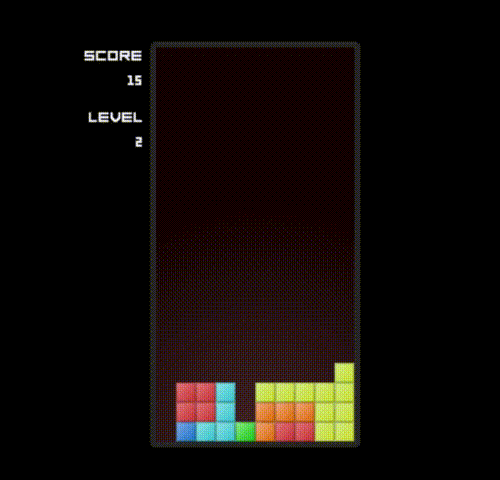

# Tetris

A stab at recreating the classic game. Goal is to apply certain (coding) techniques for learning purposes.

The game is deployed using GitHub Pages: [Play it now!](https://justusromijn.github.io/tetris)



## Issues and enhancements

Please use the issue tracker to submit new issues or enhancements. I will try to look at it regularly and make sure to reply and update the game if I feel the issues or enhancements are relevant!

## Development

Install dependencies:

```
npm install
```

Start local server (can take a bit of time when doing this for the first time):

```
npm start
```

Point your favorite browser to `http://localhost:1234` and enjoy the game.

## Technology stack

The assets required for the game are created using [Sketch](https://www.sketch.com/) and are made production-ready with [TexturePacker](https://www.codeandweb.com/texturepacker). Using TexturePacker it is easy to create optimal spritesheets for your game.

Module bundling is done with the zero config tool [Parcel](https://parceljs.org/). You just have to point it to the index.html that you have, and it will resolve all dependencies by itself, creating a single bundle with sourcemaps.

The source code uses [Phaser 3](https://phaser.io/phaser3) (game framework). State management is done using [Redux](https://redux.js.org/), and is extended with [redux-loop](https://redux-loop.js.org/).
